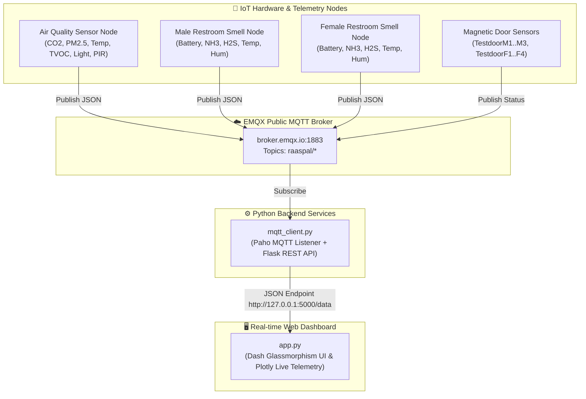

# RaasPal Smart Restroom & Showroom Telemetry Dashboard


An ultra-modern, high-performance real-time telemetry IoT dashboard built for **RaasPal Smart Restroom & Showroom Infrastructure**.

---

## 🔒 Security Audit & Dependency Resolution

The repository has been updated to resolve security alerts reported by GitHub Dependabot:

| Dependency | Original Version | Upgraded Version | Addressed Vulnerabilities |
| :--- | :--- | :--- | :--- |
| **`dompurify`** | `< 3.3.2` | `^3.3.2` | GHSA-vxr8-fq34-vvx9, GHSA-h8r8-wccr-v5f2, GHSA-cj63-jhhr-wcxv, GHSA-cjmm-f4jc-qw8r, GHSA-39q2-94rc-95cp |
| **`mermaid`** | `<= 10.9.5` | `^11.4.0` | CVE-2026-41148, CVE-2026-41149, CVE-2026-41159, CVE-2026-41150 |

---

## 🏗️ System Architecture



---

## 📡 MQTT Topics Specification

| Topic | Description | Payload Schema |
| :--- | :--- | :--- |
| `raaspal/airquality` | Showroom Air Quality Telemetry | `{"temperature": 24.5, "humidity": 55.0, "co2": 420, "pm2_5": 12.0, "pm10": 25.0, "tvoc": 85, "pressure": 1013.25, "hcho": 0.02, "light_level": 450, "pir": "motion_detected"}` |
| `raaspal/smellfamale` | Female Restroom Odor & Environment | `{"battery": 95, "temperature": 23.8, "humidity": 58.0, "nh3": 0.4, "h2s": 0.05}` |
| `raaspal/smellmale` | Male Restroom Odor & Environment | `{"battery": 92, "temperature": 24.1, "humidity": 60.0, "nh3": 0.8, "h2s": 0.08}` |
| `raaspal/TestdoorM1..M3` | Male Restroom Stall Magnetic Doors | `{"magnet_status": "open"}` or `{"magnet_status": "closed"}` |
| `raaspal/TestdoorF1..F4` | Female Restroom Stall Magnetic Doors | `{"magnet_status": "open"}` or `{"magnet_status": "closed"}` |

---

## 🚀 How to Run

### Prerequisites
- Python 3.10+
- Node.js 18+ and npm

### 1. Install Dependencies

```bash
# Install Python packages
pip install -r requirements.txt

# Verify NPM Security Audit
npm audit
```

### 2. Start MQTT Client & Backend API

```bash
python3 mqtt_client.py
```
*Runs Flask API server at `http://127.0.0.1:5000/data` with active background simulation fallback.*

### 3. Launch Dashboard UI

```bash
python3 app.py
```
*Access the live interactive dashboard in your web browser at `http://localhost:8080`.*
